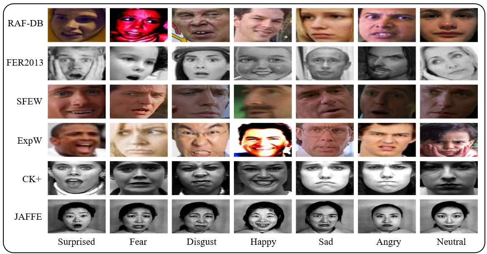

# Adaptive Global-Local Representation Learning and Selection for Cross-Domain Facial Expression Recognition
Implementation of papers:
- [Adaptive Global-Local Representation Learning and Selection for Cross-Domain Facial Expression Recognition](https://ieeexplore.ieee.org/document/10404024/authors#authors)  
  IEEE Transactions on Multimedia (IEEE TMM), 2024.  
  Yuefang Gao, Yuhao Xie, Zeke Zexi Hu, Tianshui Chen, Liang Lin
  

## Environment
Ubuntu 22.04.2 LTS, python 3.8.10, PyTorch 1.9.0.
## Datasets
Application website： [CK+](http://www.jeffcohn.net/wp-content/uploads/2020/10/2020.10.26_CK-AgreementForm.pdf100.pdf.pdf), [JAFFE](https://zenodo.org/record/3451524#.YXdc1hpBw9E), [SFEW 2.0](https://cs.anu.edu.au/few/AFEW.html), [FER2013](https://www.kaggle.com/c/challenges-in-representation-learning-facial-expression-recognition-challenge/data), [ExpW](http://mmlab.ie.cuhk.edu.hk/projects/socialrelation/index.html), [RAF](http://www.whdeng.cn/raf/model1.html).

## Trained Models
The trained models are share in: [baidu drive](https://pan.baidu.com/s/1Uhf4XeEFjHd2OgjvMNORnA?pwd=oi5d).
## Usage
```bash
cd code
bash TrainOnSourceDomain.sh     # First step
bash TransferToTargetDomain.sh  # Second step
```
## Citation
If you find our paper or code helpful, please cite our work.
```bash
@ARTICLE{10404024,
  author={Gao, Yuefang and Xie, Yuhao and Hu, Zeke Zexi and Chen, Tianshui and Lin, Liang},
  journal={IEEE Transactions on Multimedia}, 
  title={Adaptive Global-Local Representation Learning and Selection for Cross-Domain Facial Expression Recognition}, 
  year={2024},
  volume={26},
  number={},
  pages={6676-6688},
  keywords={Feature extraction;Adaptation models;Adversarial machine learning;Face recognition;Semantics;Data models;Representation learning;Domain adaptation;adverserial learning;Pseudo label generation;Facial expression recognition},
  doi={10.1109/TMM.2024.3355637}
}

@INPROCEEDINGS{9956069,
  author={Xie, Yuhao and Gao, Yuefang and Lin, Jiantao and Chen, Tianshui},
  booktitle={2022 26th International Conference on Pattern Recognition (ICPR)}, 
  title={Learning Consistent Global-Local Representation for Cross-Domain Facial Expression Recognition}, 
  year={2022},
  volume={},
  number={},
  pages={2489-2495},
  doi={10.1109/ICPR56361.2022.9956069}
}
```
## Contributors
For any questions, feel free to open an issue or contact us:
- <a href="mailto:yaoxie1001@gmail.com">yaoxie1001@gmail.com</a>
